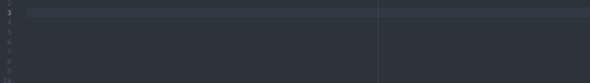

# ESLint snippets for Atom

[](https://travis-ci.org/kamataryo/eslint-snippets)

[](https://atom.io/packages/eslint-snippets)


Snippets of all ESLint rules for [Atom](https://atom.io/) editor.



## Installation

Run the following command:

```shell
apm install eslint-snippets
```

Alternatively go to `Atom > Preferences > Packages` and search for `eslint-snippets`.

## Usage

  The snippets are available on `*.js` or `*.json`.

1. type..
  - the rule name
  - "eslint-disable" or "eslint-disable-next-line"
2. complete them.

## Development

```shell
git clone git@github.com:kamataryo/eslint-snippets.git
cd eslint-snippets
npm install
npm run build
```

## Contribution

Issues and PRs are welcome!

https://github.com/kamataryo/eslint-snippets
